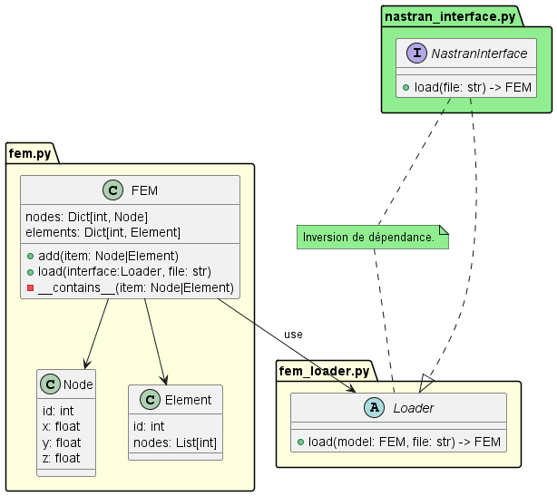

# CLEAN FEM

Exemple d'architecture hexagonal appliquée à un logiciel scientifique.

**Sommaire**

- [Principes clés de l'architecture hexagonale](#principes-clés-de-larchitecture-hexagonale)
- [Mise en place de l'environnement](#création-dun-nouveau-projet)
- [Test Driven Developpement](#test-driven-developpement)
- [Description du code](#description-du-code)

---

## Principes clés de l'architecture hexagonale

L'architecture hexagonale est faite pour faciliter la maintenabilité et l'évolution de votre code.
Le principe clé repose sur un développement en couches, où les dépendances ne peuvent se faire que vers les couches inférieures, et où la couche de plus bas niveau contient le **coeur métier** de votre logiciel (appelé Domain).

Cette architecture est très similaire aux Clean Architectures.

## Création d'un nouveau projet

Sur Github :

- créer un nouveau en demandant la création d'un fichier gitignore python.
- copier le lien du nouveau repo

Dans VS Code

- Ouvrir un terminal et executer la commande :<br>

```
git clone https://github.com/lien_vers_le_repo
```

- Créer l'environnement virtuel et l'activer

```
python -m venv venv
venv\Scripts\activate
```

- Installer les dépendances nécessaires au développement

```
python -m pip install --upgrade pip
pip install flake8 black pytest pytest-cov pytest-bdd bandit
```

> :heavy_exclamation_mark: En cas de blocage parefeu :key:, utiliser les options suivantes dans pip

```
--trusted-host pypi.org --trusted-host pypi.python.org --trusted-host files.pythonhosted.org
```

## Test Driven Developpement

Quelques commandes d'analyse du code :

```
flake8 . --statistics --exclude=venv*
pytest -svv
bandit -r library_name -c bandit-yaml
```

## Description du code

### Objectifs

Ce programme a pour objectif de construire et manipuler un modèle éléments finis (Finite Element Model - **FEM**). Pour l'exercice, on veut simplement que l'utilisateur puisse créer manuellement un modèle (avec les noeuds et éléments associés).

Nous introduisons également une interface pour pouvoir construire/charger le modèle FEM à partir d'un fichier texte.

> Les fichiers textes pourraient être au format Nastran, mais cela nécessiterait un parser plus complexe à développer. Cependant la mise en oeuvre serait la même.

<!-- ### L'Architecture Hexagonale

Le principe fondamentale de l'Architecture Hexagonale ou Clean Architecture est de travailler par _couches_ en respectant un principe de dépendance descendante (les couches supérieures on des dépendances vers les couches inférieures, mais l'inverse est interdit). Ainsi des  -->

### Le _Domain_

Le _Domain_ (contenant la logique métier de notre logiciel) est constitué de 2 fichiers :

- [fem.py](clean_fem/app/domain/fem.py) qui contient les objets relatifs à la création de notre modèle
- [fem_loader.py](clean_fem/app/domain/fem_loader.py) qui sert à faire l'inversion de dépendance pour notre interface.

Le fichier **fem_loader** contient ainsi une classe abstraite intitulée Loader, qui permet de réaliser l'inversion de dépendance, en spécifiant les méthodes devant être implémentées par l'interface.


